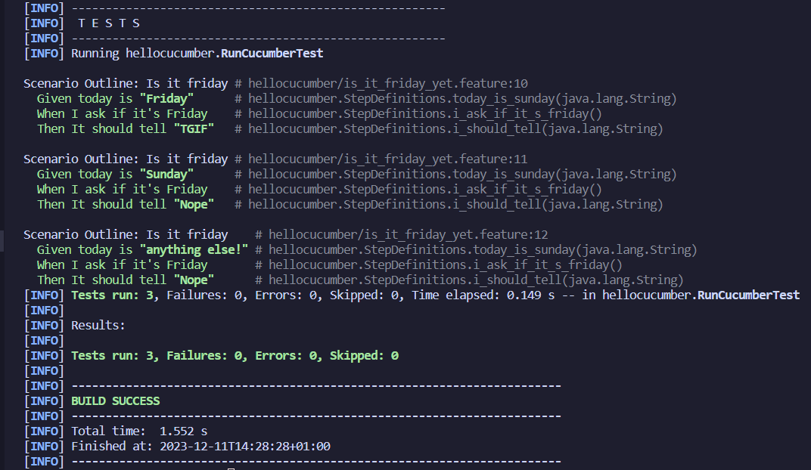
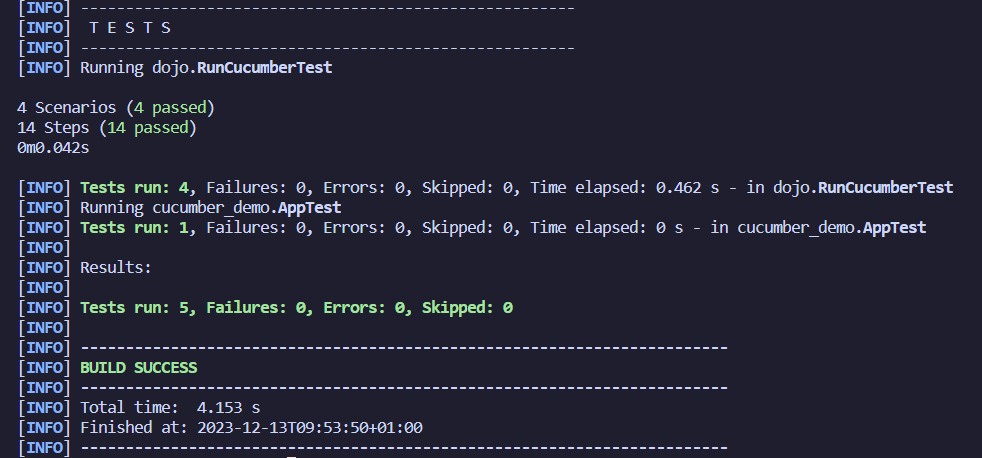
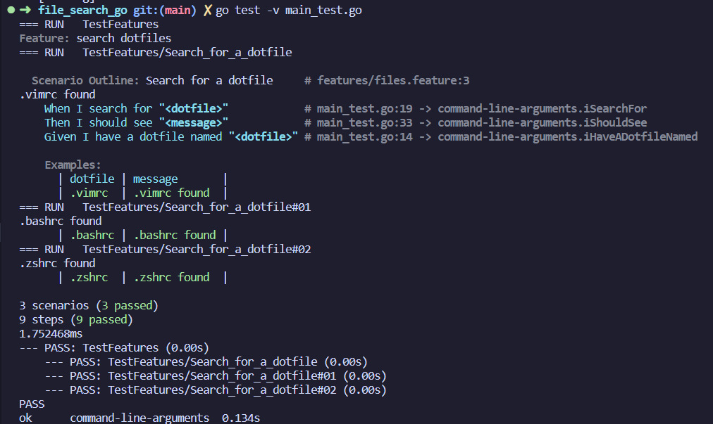
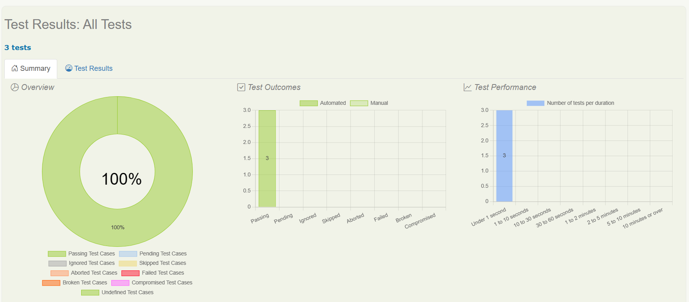

= R5.A.08 -- Dépôt pour les TPs
:icons: font
:MoSCoW: https://fr.wikipedia.org/wiki/M%C3%A9thode_MoSCoW[MoSCoW]

Ce dépôt concerne les rendus de mailto:matthieu.robert@etu.univ-tlse2.fr[Matthieu Robert].

== TP1

.Contenu du fichier [is_it_friday_yet.feature]
[source,feature]
----
Feature: Is it friday yet

  Scenario Outline: Is it friday
    Given today is "<day>"
    When I ask if it's Friday
    Then It should tell "<answer>"

  Examples:
    | day            | answer |
    | Friday         | TGIF   |
    | Sunday         | Nope   |
    | anything else! | Nope   |
----

.Résultat d'execution des test

== TP2

.Contenu du fichier Order.java
[source,java]
----
package cucumber_demo;

import java.util.ArrayList;
import java.util.List;

public class Order {
    private String owner;
    private String target;
    private List<String> cocktails = new ArrayList<String>();
    private String message;

    public void declareOwner(String owner) {
        this.owner = owner;
    }

    public void declareTarget(String target) {
        this.target = target;
    }

    public void setMessage(String message) {
        this.message = message;
    }

    public String getMessage() {
        return "From " + owner + " to " + target + ": " + message;
    }

    public List<String> getCocktails() {
        return cocktails;
    }
}
----

.Contenu du fichier CocktailStep.java
[source, java]
----
public class CocktailStep {
    private Order order;

    @Given("(.*) who wants to buy a drink")
    public void romeo_who_wants_to_buy_a_drink(String string) {
        order = new Order();
        order.declareOwner(string);
    }

    @When("an order is declared for (.*)")
    public void an_order_is_declared_for_juliette(String string) {
        order.declareTarget(string);
    }

    @Then("there is {int} cocktails in the order")
    public void there_is_cocktails_in_the_order(int nbCocktails) {
        List<String> cocktails =  order.getCocktails();
        assertEquals(nbCocktails, cocktails.size());
    }

    @When("a message saying {string} is added")
    public void a_message_saying_is_added(String string) {
        order.setMessage(string);
    }

    @Then("the ticket must say {string}")
    public void the_ticket_must_say(String string) {
        assertEquals(string, order.getMessage());
    }
}
----

.Résultat d'execution des test

== TP3

.Contenu du fichier
[source,go]
----
package main

import (
	"fmt"
	"os"
	"testing"

	"github.com/cucumber/godog"
)

var filename string
var found bool

func iHaveADotfileNamed(arg1 string) error {
	filename = arg1
	return nil
}

func iSearchFor(arg1 string) error {
	_, err := os.ReadFile("/home/matth/" + filename)

	if err != nil {
		found = false
		return err
	}

	// fmt.Print(string(dat))
	found = true

	return nil
}

func iShouldSee(arg1 string) error {
	if found {
		fmt.Println(filename + " found")
		return nil
	} else {
		fmt.Println(filename + " not found")
		return fmt.Errorf("File not found")
	}
}

func InitializeScenario(ctx *godog.ScenarioContext) {
	ctx.Step(`^I have a dotfile named "([^"]*)"$`, iHaveADotfileNamed)
	ctx.Step(`^I search for "([^"]*)"$`, iSearchFor)
	ctx.Step(`^I should see "([^"]*)"$`, iShouldSee)
}

func TestFeatures(t *testing.T) {
	suite := godog.TestSuite{
		ScenarioInitializer: InitializeScenario,
		Options: &godog.Options{
			Format:   "pretty",
			Paths:    []string{"features"},
			TestingT: t, // Testing instance that will run subtests.
		},
	}

	if suite.Run() != 0 {
		t.Fatal("non-zero status returned, failed to run feature tests")
	}
}
----

.Résultat d'execution des test

== TP4

.Résultat du rapport généré avec Serenity pour hellocucumber

Liens : https://htmlpreview.github.io/?https://github.com/IUT-Blagnac/r5-a-08-qualdev-matthieurobert/blog/main/hellocucumber/serenity/index/html

